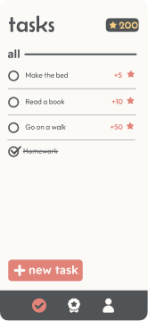
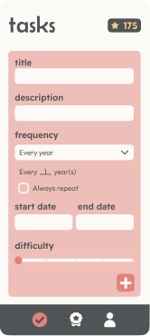
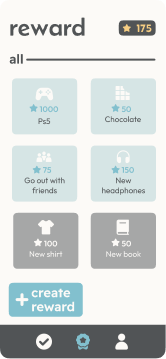
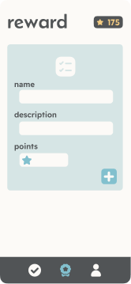
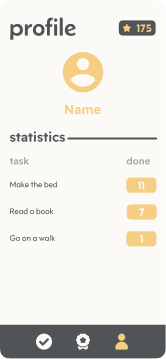
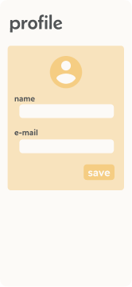

# Taskward: The Gamified Task App

[](https://github.com/usuario/taskward) [](LICENSE)

🌐 **Read this in other languages:** [🇧🇷 Português](./docs/README.pt-BR.md)

Taskward is an innovative Android app that turns task management into a motivating and fun experience using gamification elements.

## Features

- **Task Creation with Frequency and Interval**  
  Plan your tasks flexibly: choose between daily, weekly, monthly, or yearly repetitions with configurable intervals.
  
- **Scoring and Gamification**  
  Earn points by completing tasks and track your progress.

- **Custom Rewards**  
  Set up personalized rewards to motivate you to achieve your goals.

- **Profile and Statistics System**  
  View your history, statistics, and performance directly in the app.

- **Local Storage and Privacy**  
  Your data is stored securely and offline, with no dependency on an internet connection.

## Screenshots

|  |  |
|-----------------------------------|-----------------------------------------------|
| _Tasks screen._                   | _Task creation screen._                       |

|  |  |
|---------------------------------------|---------------------------------------------------|
| _Rewards screen._                     | _Reward creation screen._                         |

|  |  |
|---------------------------------------|-----------------------------------------------------|
| _Profile screen._                     | _Profile creation screen._                          |

## How It Works

1. **Task Creation:** Set task frequencies and intervals to organize your activities.  
2. **Earn Points:** Complete tasks and watch your points grow.  
3. **Redeem Rewards:** Use your points to unlock personalized prizes.  
4. **Track Your Progress:** Check your profile and adjust your goals.  


## Installation

### Prerequisites
- **Android Studio** (minimum version: 4.2)  
- **Android SDK** (API 26+)  

### Steps

1. Clone this repository:  
   ```bash
   git clone https://github.com/Dev-Luiz-Henrique/Taskward.git
2. Open the project in Android Studio.
3. Sync with Gradle.
4. Run the app on an emulator or physical device.

### Installation via APK

If you just want to test the app, download the APK file from the link below and install it directly on your Android device: [APK Download](#)  

---
## Technologies Used

- **Programming Language:** Java  
- **Database:** SQLite  
- **Architecture:** MVC (Model-View-Controller)  
- **Dependencies:**  
  - Material Design  
  - AppCompat  
  - Navigation Component  
  - JUnit, Mockito, Espresso (for testing)  
---

## Contributing

Contributions are welcome! To collaborate:

1. Fork the repository.  
2. Create a branch for your feature:  
	```bash 
   git checkout -b my-feature
3. Submit a pull request detailing the changes.

## License

This project is licensed under the **Creative Commons Attribution-NonCommercial 4.0 International (CC BY-NC 4.0)** License. You are free to share and adapt the material for non-commercial purposes, as long as you give appropriate credit. For more details, see the [LICENSE](./docs/LICENSE) file.

## Contact

- **GitHub:** [@Dev-Luiz-Henrique](https://github.com/Dev-Luiz-Henrique)  
- **E-mail:** dev.luizhenrique@outlook.com  
